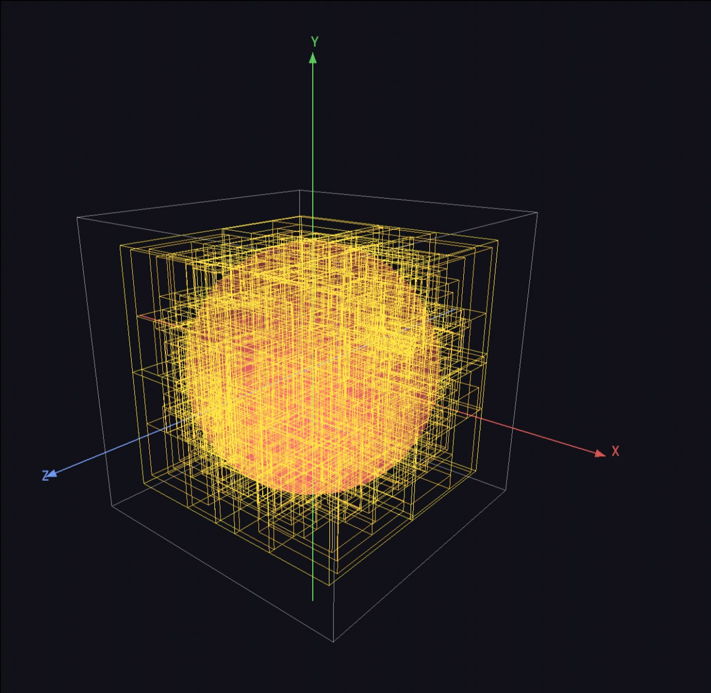
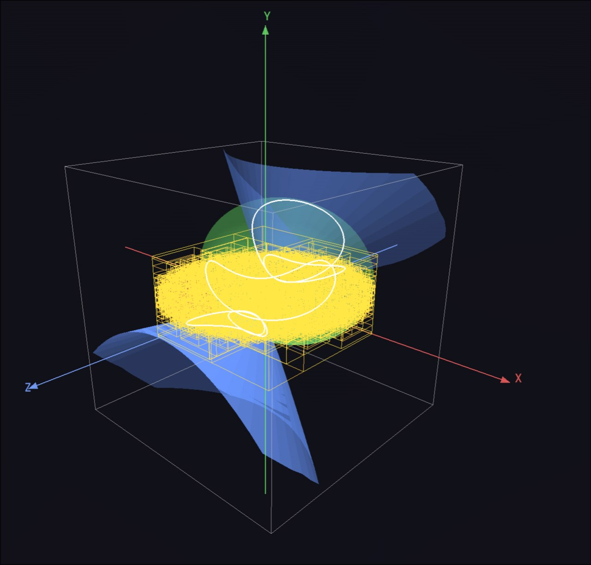

# Quadric-Intersections

[Russian version](README.md)

Desktop GUI application for:

1. Building **9 canonical second-order surfaces** (ellipsoid, one-sheet
   and two-sheet hyperboloids, elliptic and hyperbolic paraboloids,
   cone, elliptic, hyperbolic and parabolic cylinders).
2. Triangulating each surface with **two independent methods** —
   Marching Cubes and a parametric grid with AABB clipping —
   for performance comparison.
3. Computing **pairwise intersection curves** between the meshes,
   with timing and polyline assembly.
4. Persisting results in SQLite, with a results table and a
   3D viewer.

C++17 + Qt 6 + Eigen 3. No external dependencies beyond vcpkg for Eigen
and GoogleTest.

## Requirements

- CMake ≥ 3.20
- Qt 6.4+ — system installation. Components: `Widgets`, `Sql`, `OpenGLWidgets`,
  `Concurrent`, `Test`
- C++17 compiler: GCC 11+ (Linux) or MSVC 2022 (Windows)
- OpenGL 3.3 Core (for `QOpenGLWidget` in `Viewport3D`)
- [vcpkg](https://github.com/microsoft/vcpkg) — for Eigen 3 and GoogleTest.
  The `VCPKG_ROOT` environment variable must point to the vcpkg directory.

### Installing vcpkg (if you don't have it yet)

```bash
git clone https://github.com/microsoft/vcpkg.git ~/vcpkg
~/vcpkg/bootstrap-vcpkg.sh              # Linux
# or .\bootstrap-vcpkg.bat              # Windows
export VCPKG_ROOT=~/vcpkg
```

## Build

### Linux (GCC + Ninja)

```bash
cmake --preset linux-gcc-debug
cmake --build --preset linux-gcc-debug
```

For a Release build replace `debug` with `release`.

### Windows (MSVC 2022)

```powershell
cmake --preset windows-msvc-debug
cmake --build --preset windows-msvc-debug
```

## Run

```bash
./build/linux-gcc-debug/quadric_intersections
```

On the first launch `experiments.db` (SQLite) is created.

## Walkthrough

<p>
  
  <br>
  <sub><i>The «Experiment» tab: bounding box, full surface parameters, triangulation method, surface list, and selection between BVH and naive space partitioning.</i></sub>
</p>

<p>
  
  <br>
  <sub><i>The «Results» tab: pairwise-intersection table with timings, segment count and polyline count.</i></sub>
</p>

<p>
  
  <br>
  <sub><i>The «3D» tab: coloured <code>X</code>, <code>Y</code>, <code>Z</code> axes, AABB wireframe, meshes, and white intersection polylines.</i></sub>
</p>

<p>
  
  <br>
  <sub><i>The same scene from a different angle — the orbital camera is driven by LMB-drag (rotate), wheel (zoom) and RMB-drag (pan).</i></sub>
</p>

<p>
  
  <br>
  <sub><i>Visualization of the BVH tree built over the mesh triangles.</i></sub>
</p>

<p>
  
  <br>
  <sub><i>An experiment using the BVH accelerator for intersection search.</i></sub>
</p>

## Usage

### «Experiment» tab

1. Set the bounding box for this experiment (six min/max spinboxes).
2. The **`+`** button adds a surface; on the right you pick the type, parameters
   (`a`, `b`, `c`, `p` depending on the type), Transform (translation + rotation),
   and triangulation method (parametric with `uSteps`/`vSteps` or
   marching_cubes with `resolution`).
3. At the bottom: choice of intersection method (BVH or Naive), notes, and
   buttons — **Save…** / **Load…** save/load the experiment configuration as
   a JSON file, and **Run** starts the experiment.
4. **Run** spawns the orchestrator on a separate thread via `QtConcurrent`,
   progress is shown in the bottom `QProgressBar`. When done — a
   `QMessageBox`, and the other two tabs auto-refresh.

### «Results» tab

- Inner tabs: **Intersection pairs** and **Experiments**.
- Pairs — a table over a JOIN of three DB tables, sortable by any column,
  with substring filtering across all columns.
- Experiments — list of experiments; double-click → details dialog
  (bbox, surfaces, intersections with timings).
- **Delete selected** — removes the selected experiment.
- **Export CSV…** — exports the currently visible table (respecting sorting
  and filtering).

### «3D» tab

- Left — the list of saved experiments.
- Right — a `QOpenGLWidget` with an orbital camera:
  - **LMB drag** — rotate,
  - **wheel** — zoom,
  - **RMB drag** — pan.
- Overlaid on the scene: AABB wireframe and three coloured axes —
  X red, Y green, Z blue — with arrows and `X`, `Y`, `Z` labels at the tips
  (drawn with a `QPainter` overlay on top of the GL frame).
- Selecting an experiment recomputes the meshes **from the parameters**
  (the DB stores only numbers and timings, not meshes).

### Ready-made JSON configs

`samples/` ships 14 reference scenes (`01_two_spheres.json`,
`02_steinmetz.json`, etc.) — intersecting, non-intersecting, and edge
cases. Open them via **Experiment → Load…**.

## Tests

```bash
ctest --preset linux-gcc-debug
```

`--output-on-failure` is enabled by default in the preset. Current scope —
**159 tests**, ~80–90 seconds in Debug (on Intel Core i7-12700H).

## Project layout
```
├── .clang-format
├── .gitignore
├── CMakeLists.txt
├── CMakePresets.json
├── README.md
├── vcpkg.json
├── .github/                             # for Github Actions
│   └── workflows/
│       └── ci.yml
├── docs/
│   ├── RR-4488.pdf                      # Devillers & Guigue 2002 paper
│   └── images/                          # README screenshots
├── samples/                             # 14 ready-made JSON scenes
│   ├── 01_two_spheres.json
│   ├── 02_steinmetz.json
│   ├── ...
│   └── 14_five_surfaces_stress.json
├── src/
│   ├── main.cpp
│   ├── geometry/                        # core: quadrics and geometry (C++ + Eigen, no Qt)
│   │   ├── Vec3.hpp
│   │   ├── Transform.{hpp,cpp}
│   │   ├── BoundingBox.{hpp,cpp}
│   │   ├── Quadric.hpp
│   │   ├── QuadricFactory.{hpp,cpp}
│   │   ├── Ellipsoid.{hpp,cpp}
│   │   ├── HyperboloidOneSheet.{hpp,cpp}
│   │   ├── HyperboloidTwoSheet.{hpp,cpp}
│   │   ├── EllipticParaboloid.{hpp,cpp}
│   │   ├── HyperbolicParaboloid.{hpp,cpp}
│   │   ├── Cone.{hpp,cpp}
│   │   ├── EllipticCylinder.{hpp,cpp}
│   │   ├── HyperbolicCylinder.{hpp,cpp}
│   │   └── ParabolicCylinder.{hpp,cpp}
│   ├── mesh/                            # Mesh / Polyline / Segment (C++ + Eigen, no Qt)
│   │   ├── Mesh.{hpp,cpp}
│   │   └── Polyline.hpp
│   ├── triangulation/                   # MC and parametric triangulator (C++, no Qt)
│   │   ├── ITriangulator.hpp
│   │   ├── MarchingCubes.{hpp,cpp}
│   │   ├── MarchingCubesParams.hpp
│   │   ├── ParametricTriangulator.{hpp,cpp}
│   │   └── ParametricParams.hpp
│   ├── intersection/                    # Devillers-Guigue + Naive/BVH + PolylineBuilder (C++)
│   │   ├── Orient3d.{hpp,cpp}
│   │   ├── TriangleTriangle.{hpp,cpp}
│   │   ├── MeshIntersector.hpp
│   │   ├── NaiveIntersector.{hpp,cpp}
│   │   ├── BvhIntersector.{hpp,cpp}
│   │   └── PolylineBuilder.{hpp,cpp}
│   ├── experiment/                      # orchestrator + JSON config (Qt6::Core)
│   │   ├── ExperimentConfig.hpp
│   │   ├── ExperimentResult.{hpp,cpp}
│   │   ├── ExperimentRunner.{hpp,cpp}
│   │   └── ConfigJson.{hpp,cpp}
│   ├── storage/                         # SQLite via Qt6::Sql
│   │   ├── DatabaseManager.{hpp,cpp}
│   │   └── ExperimentRepository.{hpp,cpp}
│   └── ui/                              # Qt6::Widgets / OpenGLWidgets / Concurrent
│       ├── MainWindow.{hpp,cpp,ui}
│       ├── ExperimentTab.{hpp,cpp}
│       ├── ResultsTab.{hpp,cpp}
│       ├── ViewTab.{hpp,cpp}
│       ├── SurfaceEditorWidget.{hpp,cpp}
│       ├── QuadricParamsWidget.{hpp,cpp}
│       ├── TransformWidget.{hpp,cpp}
│       ├── TriangulationParamsWidget.{hpp,cpp}
│       ├── BoundingBoxWidget.{hpp,cpp}
│       ├── Viewport3D.{hpp,cpp}
│       └── OrbitalCamera.{hpp,cpp}
└── tests/                               # GoogleTest + Qt::Test
    ├── test_main.cpp
    ├── test_utils.hpp
    ├── geometry_tests.cpp
    ├── mesh_tests.cpp
    ├── triangulation_tests.cpp
    ├── intersection_tests.cpp
    ├── experiment_tests.cpp
    ├── storage_tests.cpp
    └── ui_tests.cpp
```

## Algorithms

### Triangulation

- **Marching Cubes** — classic Paul Bourke LUTs (`edgeTable[256]` +
  `triTable[256][16]`, public domain). The implicit function is sampled
  on a `(N+1)³` grid once, then `N³` cubes are walked with edge-intersection
  interpolation. No vertex deduplication on the first pass. Vertex error
  ≈ `diagonal/N`.
- **Parametric** — a `(uSteps+1) × (vSteps+1)` grid of points via
  `Quadric::parametric(u, v)`, each quad split into 2 triangles, then each
  triangle is clipped against the 6 bbox planes and the result re-triangulated.
  Vertex precision before clipping — `kEpsTight = 1e-9`.
  Quadrics with parametrization discontinuities (`HyperboloidTwoSheet` —
  two sheets; `HyperbolicCylinder` — two branches) declare
  `u/vDiscontinuities()`; any quad spanning a discontinuity is dropped so
  the two disconnected components don't get bridged. If skipping leaves
  one side of the discontinuity without an apex (e.g. the lower sheet of
  the two-sheet hyperboloid: `parametric(u, 0)` returns the *upper* apex),
  the quadric supplies a synthetic point via
  `closingApex{Below,Above}{U,V}()`, and the triangulator fans it to the
  nearest ring with the same bbox clipping applied.

### Triangle-triangle intersection

Devillers & Guigue 2002, "Faster Triangle-Triangle Intersection Tests"
(INRIA RR-4488). All branching is driven by `orient3d` signs (a degree-3
determinant). Compared to Möller 1997: degree 3 vs 8, ~20–30 % faster in
IEEE double, 2–3× fewer false positives on near-tangent configurations.

In addition, before the main algorithm runs — an AABB filter (Step 0):
it rejects numerically-borderline false positives where the triangles are
in fact far apart.

### Mesh-mesh intersection

- **Naive** — a double O(n·m) loop over triangle pairs.
- **BVH** — an AABB tree over the triangles of mesh A. Built via
  `nth_element` on the median centroid along the longest axis, leaf size 8.
  Query — a range query against the AABB of each triangle in mesh B. On
  ~3000-triangle meshes each it gives a **~320× speedup** over Naive
  (97 ms vs 31 s in Debug).

### Polyline assembly

Unique points (epsilon-merging) → edge graph → connected-component traversal
via DFS forward-then-backward from the seed edge. A closed polyline carries
its first point repeated at the end.

## References

- O. Devillers, P. Guigue. *Faster Triangle-Triangle Intersection Tests*.
  INRIA Research Report RR-4488, 2002.
  [hal.inria.fr/inria-00072100](https://hal.inria.fr/inria-00072100)
- W. E. Lorensen, H. E. Cline. *Marching Cubes: A High Resolution 3D Surface
  Construction Algorithm*. SIGGRAPH '87.
- P. Bourke. *Polygonising a scalar field*. 1994.
  [paulbourke.net/geometry/polygonise](http://paulbourke.net/geometry/polygonise/)
- I. E. Sutherland, G. W. Hodgman. *Reentrant Polygon Clipping*.
  Communications of the ACM, 17(1):32–42, 1974.
