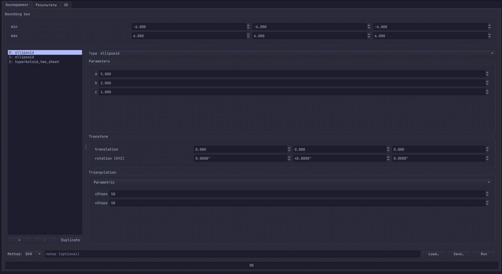
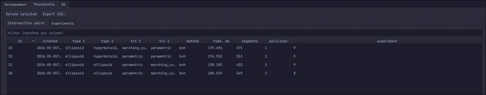
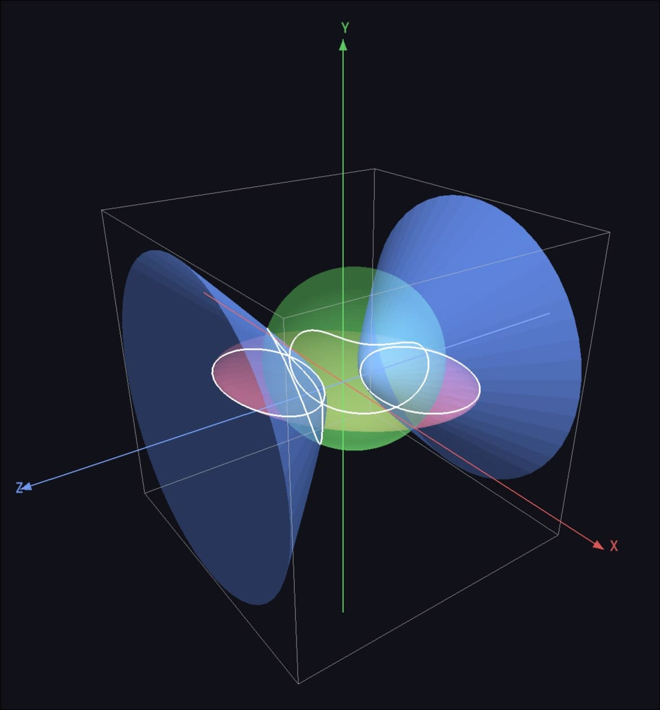
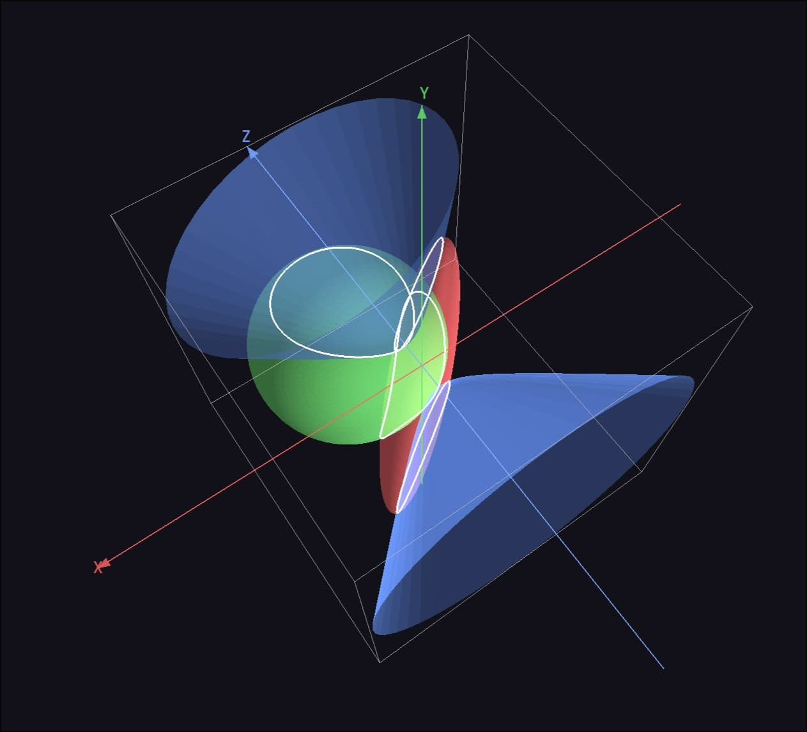

# Quadric-Intersections

[English version](README.en.md)

Приложение с графическим интерфейсом для:

1. Построения **9 канонических поверхностей второго порядка** (эллипсоид,
   однополостный и двуполостный гиперболоиды, эллиптический и гиперболический
   параболоиды, конус, эллиптический, гиперболический и параболический
   цилиндры).
2. Триангуляции каждой поверхности **двумя независимыми методами** -
   Marching Cubes и параметрической сеткой с клиппингом по AABB -
   для сравнения скорости.
3. Поиска **попарных линий пересечения** между сетками с замером времени и
   сборкой полилиний.
4. Хранения результатов в SQLite с просмотром таблицы и
   3D-визуализацией.

C++17 + Qt 6 + Eigen 3. Без других внешних зависимостей помимо vcpkg для Eigen
и GoogleTest.

## Требования

- CMake ≥ 3.20
- Qt 6.4+ — системная установка. Компоненты: `Widgets`, `Sql`, `OpenGLWidgets`,
  `Concurrent`, `Test`
- Компилятор C++17: GCC 11+ (Linux) или MSVC 2022 (Windows)
- OpenGL 3.3 Core (для `QOpenGLWidget` в `Viewport3D`)
- [vcpkg](https://github.com/microsoft/vcpkg) — для Eigen 3 и GoogleTest.
  Переменная окружения `VCPKG_ROOT` должна указывать на каталог vcpkg.

### Установка vcpkg (если ещё нет)

```bash
git clone https://github.com/microsoft/vcpkg.git ~/vcpkg
~/vcpkg/bootstrap-vcpkg.sh              # Linux
# или .\bootstrap-vcpkg.bat             # Windows
export VCPKG_ROOT=~/vcpkg
```

## Сборка

### Linux (GCC + Ninja)

```bash
cmake --preset linux-gcc-debug
cmake --build --preset linux-gcc-debug
```

Для Release-сборки заменить `debug` на `release`.

### Windows (MSVC 2022)

```powershell
cmake --preset windows-msvc-debug
cmake --build --preset windows-msvc-debug
```

## Запуск

```bash
./build/linux-gcc-debug/quadric_intersections
```

При первом запуске создаётся `experiments.db` (SQLite).

## Пример работы

<p>
  
  <br>
  <sub><i>Вкладка «Эксперимент»: задание ограничивающего объёма, всех параметров поверхностей, метода триангуляции, список поверхностей, а также выбор между BVH и наивной реализацией разбиения пространства.</i></sub>
</p>

<p>
  
  <br>
  <sub><i>Вкладка «Результаты»: таблица попарных пересечений с временем, числом сегментов и полилиний.</i></sub>
</p>

<p>
  
  <br>
  <sub><i>Вкладка «3D»: цветные оси <code>X</code>, <code>Y</code>, <code>Z</code>, каркас AABB, меши и белые полилинии пересечения.</i></sub>
</p>

<p>
  
  <br>
  <sub><i>Сцена под другим ракурсом — орбитальная камера управляется ЛКМ-drag (вращение), колесом (зум) и ПКМ-drag (смещение).</i></sub>
</p>

## Использование

### Вкладка «Эксперимент»

1. Задайте ограничивающий объём для данного эксперимента (6 спинбоксов min/max).
2. Кнопка **`+`** добавляет surface; справа выбирается тип, параметры (`a`,
   `b`, `c`, `p` в зависимости от типа), Transform (translation + rotation), и метод триангуляции (parametric с `uSteps`/`vSteps` или
   marching_cubes с `resolution`).
3. Снизу - выбор метода пересечения (BVH или Naive), notes и кнопки: **Save…** / **Load…** сохраняют/загружают конфиг эксперимента в JSON-файл и **Run** (запуск).
4. **Run** запускает оркестратор в отдельном потоке через `QtConcurrent`,
   прогресс — в нижнем `QProgressBar`. После завершения — `QMessageBox` и
   автообновление двух других вкладок.

### Вкладка «Результаты»

- Внутренние вкладки: **Intersection pairs** и **Experiments**.
- Pairs - таблица из JOIN трёх таблиц БД с сортировкой по любой колонке и
  фильтром по подстроке во всех колонках.
- Experiments - список экспериментов; двойной клик → диалог с подробностями
  (bbox, surfaces, intersections с временем).
- **Delete selected** - удаляет выбранный эксперимент.
- **Export CSV…** — экспорт текущей видимой таблицы (с учётом сортировки и
  фильтра).

### Вкладка «3D»

- Слева — список сохранённых экспериментов.
- Справа — `QOpenGLWidget` с орбитальной камерой:
  - **ЛКМ drag** — вращение,
  - **колесо** — зум,
  - **ПКМ drag** — смещение.
- Поверх сцены: каркас AABB и три цветные оси -
  X красная, Y зелёная, Z синяя - со стрелками и подписями `X` , `Y` , `Z`
  у концов (рисуются `QPainter`-оверлеем поверх GL-кадра).
- При выборе эксперимента сетки **пересчитываются заново** из параметров
  (в БД меши не хранятся, только числа и времена).

### Готовые JSON-конфиги

В `samples/` лежат 14 эталонных сцен (`01_two_spheres.json`,
`02_steinmetz.json` и т.д.) - пересекающиеся, непересекающиеся и
граничные случаи. Открываются через **Эксперимент → Load…**.

## Тесты

```bash
ctest --preset linux-gcc-debug
```

`--output-on-failure` включён по умолчанию в пресете. Текущий объём —
**159 тестов**, ~80–90 секунд в Debug (на Intel Core i7-12700H).

## Структура проекта
```
├── .clang-format
├── .gitignore
├── CMakeLists.txt
├── CMakePresets.json
├── README.md
├── vcpkg.json
├── .github/                             # для Github Actions
│   └── workflows/
│       └── ci.yml
├── docs/
│   ├── RR-4488.pdf                      # Статья Devillers & Guigue 2002
│   └── images/                          # скриншоты для README
├── samples/                             # 14 готовых JSON-сцен
│   ├── 01_two_spheres.json
│   ├── 02_steinmetz.json
│   ├── ...
│   └── 14_five_surfaces_stress.json
├── src/
│   ├── main.cpp
│   ├── geometry/                        # ядро: квадрики и геометрия (C++ + Eigen, без Qt)
│   │   ├── Vec3.hpp
│   │   ├── Transform.{hpp,cpp}
│   │   ├── BoundingBox.{hpp,cpp}
│   │   ├── Quadric.hpp                 
│   │   ├── QuadricFactory.{hpp,cpp}
│   │   ├── Ellipsoid.{hpp,cpp}
│   │   ├── HyperboloidOneSheet.{hpp,cpp}
│   │   ├── HyperboloidTwoSheet.{hpp,cpp}
│   │   ├── EllipticParaboloid.{hpp,cpp}
│   │   ├── HyperbolicParaboloid.{hpp,cpp}
│   │   ├── Cone.{hpp,cpp}
│   │   ├── EllipticCylinder.{hpp,cpp}
│   │   ├── HyperbolicCylinder.{hpp,cpp}
│   │   └── ParabolicCylinder.{hpp,cpp}
│   ├── mesh/                            # Mesh / Polyline / Segment (C++ + Eigen, без Qt)
│   │   ├── Mesh.{hpp,cpp}
│   │   └── Polyline.hpp
│   ├── triangulation/                   # MC и параметрический триангулятор (C++, без Qt)
│   │   ├── ITriangulator.hpp
│   │   ├── MarchingCubes.{hpp,cpp}
│   │   ├── MarchingCubesParams.hpp
│   │   ├── ParametricTriangulator.{hpp,cpp}
│   │   └── ParametricParams.hpp
│   ├── intersection/                    # Devillers-Guigue + Naive/BVH + PolylineBuilder (C++)
│   │   ├── Orient3d.{hpp,cpp}
│   │   ├── TriangleTriangle.{hpp,cpp}
│   │   ├── MeshIntersector.hpp
│   │   ├── NaiveIntersector.{hpp,cpp}
│   │   ├── BvhIntersector.{hpp,cpp}
│   │   └── PolylineBuilder.{hpp,cpp}
│   ├── experiment/                      # оркестратор + JSON-конфиг (Qt6::Core)
│   │   ├── ExperimentConfig.hpp
│   │   ├── ExperimentResult.{hpp,cpp}
│   │   ├── ExperimentRunner.{hpp,cpp}
│   │   └── ConfigJson.{hpp,cpp}
│   ├── storage/                         # SQLite через Qt6::Sql
│   │   ├── DatabaseManager.{hpp,cpp}
│   │   └── ExperimentRepository.{hpp,cpp}
│   └── ui/                              # Qt6::Widgets / OpenGLWidgets / Concurrent
│       ├── MainWindow.{hpp,cpp,ui}
│       ├── ExperimentTab.{hpp,cpp}
│       ├── ResultsTab.{hpp,cpp}
│       ├── ViewTab.{hpp,cpp}
│       ├── SurfaceEditorWidget.{hpp,cpp}
│       ├── QuadricParamsWidget.{hpp,cpp}
│       ├── TransformWidget.{hpp,cpp}
│       ├── TriangulationParamsWidget.{hpp,cpp}
│       ├── BoundingBoxWidget.{hpp,cpp}
│       ├── Viewport3D.{hpp,cpp}
│       └── OrbitalCamera.{hpp,cpp}
└── tests/                               # GoogleTest + Qt::Test
    ├── test_main.cpp
    ├── test_utils.hpp
    ├── geometry_tests.cpp
    ├── mesh_tests.cpp
    ├── triangulation_tests.cpp
    ├── intersection_tests.cpp
    ├── experiment_tests.cpp
    ├── storage_tests.cpp
    └── ui_tests.cpp
```

## Алгоритмы

### Триангуляция

- **Marching Cubes** — классические LUT Пола Бурка (`edgeTable[256]` +
  `triTable[256][16]`, public domain). Сэмплируется неявная функция на сетке
  `(N+1)³` точек один раз, потом обход `N³` кубов с интерполяцией пересечений
  рёбер. Без дедупликации вершин на первом проходе. Вершинная погрешность
  ≈ `diagonal/N`.
- **Параметрическая** — сетка `(uSteps+1) × (vSteps+1)` точек через
  `Quadric::parametric(u, v)`, каждый квад разбивается на 2 треугольника, потом
  клиппинг каждого треугольника по 6 плоскостям bbox через и триангуляция результата. Точность вершин
  до клиппинга — `kEpsTight = 1e-9`.
  Квадрики с разрывами параметризации (`HyperboloidTwoSheet` —
  две полости; `HyperbolicCylinder` — две ветви) объявляют
  `u/vDiscontinuities()`; квад, попадающий на разрыв, отбрасывается,
  чтобы не «соединить мостом» две несвязные компоненты. Если после
  пропуска одна из сторон разрыва теряет апекс (например, нижняя пола
  гиперболоида: `parametric(u, 0)` — это верхний апекс), квадрика
  возвращает синтетическую точку через `closingApex{Below,Above}{U,V}()`,
  и триангулятор фанит её к ближайшему ring'у с тем же bbox-клиппингом.

### Пересечение треугольников

Devillers & Guigue 2002, "Faster Triangle-Triangle Intersection Tests"
(INRIA RR-4488). Все ветвления — знаки `orient3d` (определитель степени 3).
По сравнению с Möller 1997: степень 3 vs 8, ~20–30 % быстрее в IEEE double,
2–3× меньше ложных срабатываний на почти-касательных конфигурациях.

Дополнительно перед основным алгоритмом — AABB-фильтр (Step 0): отсекает
численно-граничные ложные срабатывания, когда треугольники реально далеко.

### Пересечение мешей

- **Naive** — двойной цикл O(n·m) по треугольникам.
- **BVH** — AABB-tree поверх треугольников меша A. Билд через `nth_element`
  по медиане центроидов на самой длинной оси, leaf size = 8. Запрос —
  range-query по AABB треугольника меша B. На сетках ~3000 треугольников
  каждая даёт **~320× ускорение** по сравнению с Naive (97 ms vs 31 s в
  Debug).

### Сборка полилиний

Уникальные точки (epsilon-merging) → граф рёбер → обход компонент связности
через DFS forward-then-backward от seed-ребра. Замкнутая полилиния
содержит повторённую первую точку в конце.

## Литература

- O. Devillers, P. Guigue. *Faster Triangle-Triangle Intersection Tests*.
  INRIA Research Report RR-4488, 2002.
  [hal.inria.fr/inria-00072100](https://hal.inria.fr/inria-00072100)
- W. E. Lorensen, H. E. Cline. *Marching Cubes: A High Resolution 3D Surface
  Construction Algorithm*. SIGGRAPH '87.
- P. Bourke. *Polygonising a scalar field*. 1994.
  [paulbourke.net/geometry/polygonise](http://paulbourke.net/geometry/polygonise/)
- I. E. Sutherland, G. W. Hodgman. *Reentrant Polygon Clipping*.
  Communications of the ACM, 17(1):32–42, 1974.

